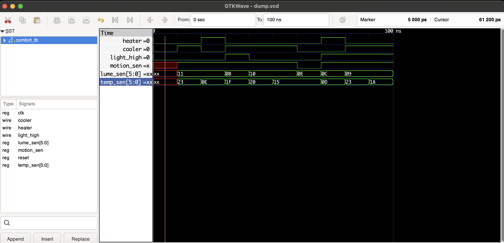

# Smart Home Automation using Verilog

## Overview
This project focuses on automating temperature and lighting control based on motion, temperature sensor data, and light sensor data.

## Setup and Installation
### Prerequisites
- Verilog simulator (Icarus Verilog)
- GTKWave for waveform visualization

### Installation
1. Clone the repository:
   ```bash
   git clone https://github.com/ayushkumar912/Smart_Home_Automation-using-verilog.git
   ```

2. Navigate to the project directory:
   ```bash
   cd Smart_Home_Automation-using-verilog
   ```

## Running the Simulation
1. Compile the Verilog files:
   ```bash
   iverilog -o simulation comfort_tb.v Smart_home.v
   ```

2. Run the simulation:
   ```bash
   vvp simulation
   ```

3. Check if a dump file (`dump.vcd`) is created.

## Viewing Waveforms
1. Open GTKWave:
   ```bash
   gtkwave dump.vcd
   ```

2. This will display waveform visualizations similar to the example below:

   

## Contributing
Contributions are welcome! Please feel free to submit issues or pull requests.

## License
This project is licensed under the MIT License. See the [LICENSE](LICENSE) file for details.
